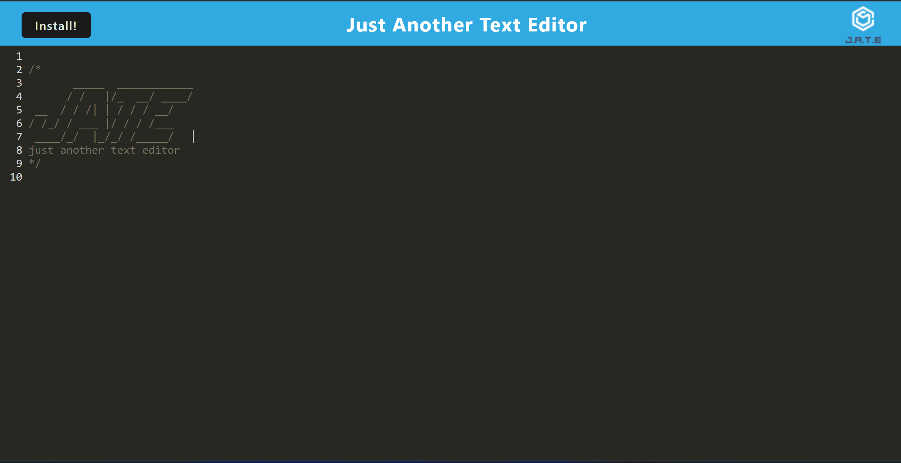

# The PWA Text Editor

## Table of Contents 

- [Description](#description)
- [Access](#access)
- [Credits](#credits)
- [License](#license)

## Description

This application is a progressive web application text editor. This program can be installed locally and will be able to work offline.

## Access
[Deployed Application](https://warm-fortress-80521.herokuapp.com/)

[Github Repository](https://github.com/difurung/The-Progressive-Web-Application-Text-Editor)

# Screenshot

## Screenshot of Web Application

## Screenshot of Installed Application

## License

## How to Contribute
Any suggestions are welcome and may be made using the comment section. Pull requests are welcome.
